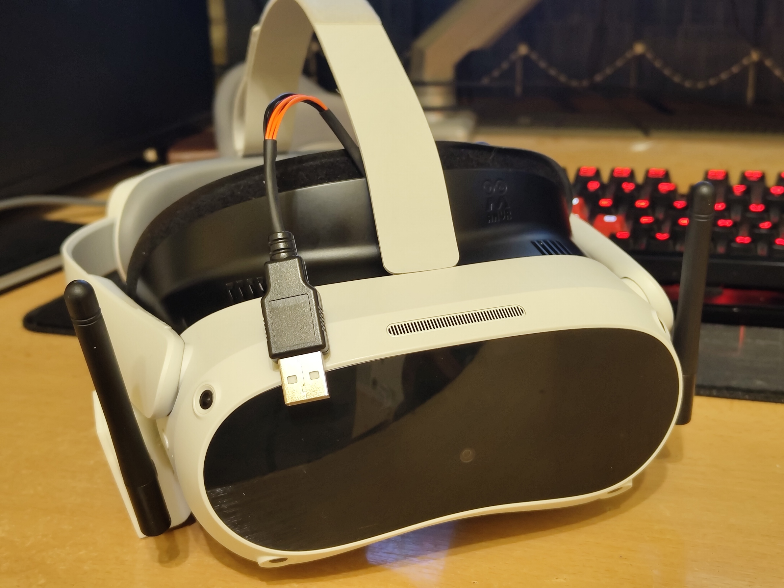
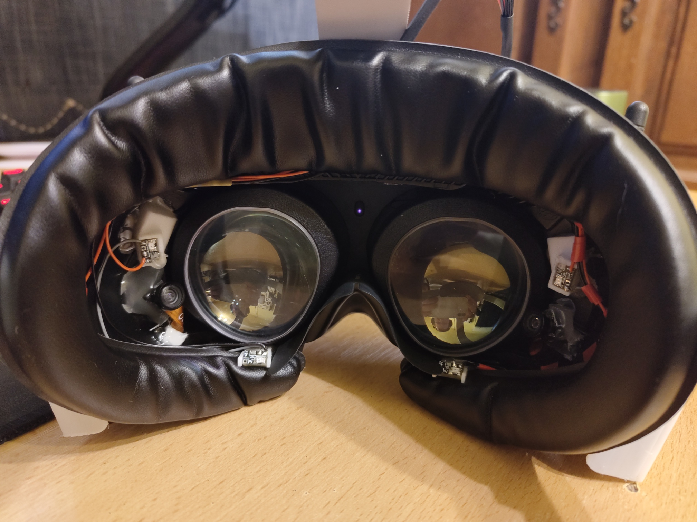
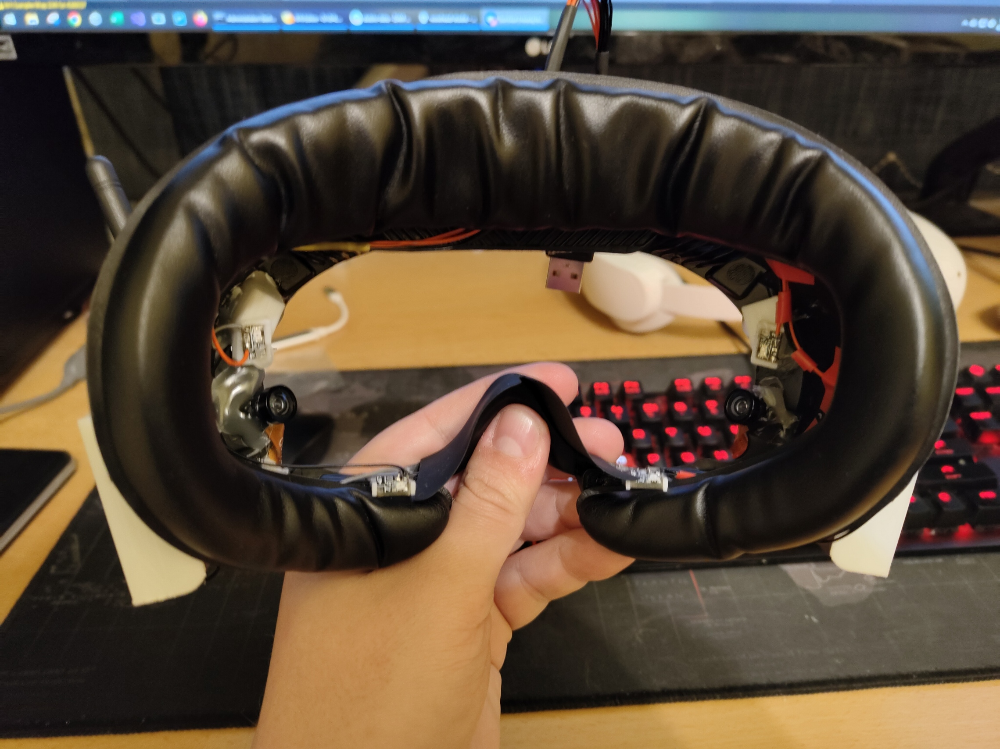
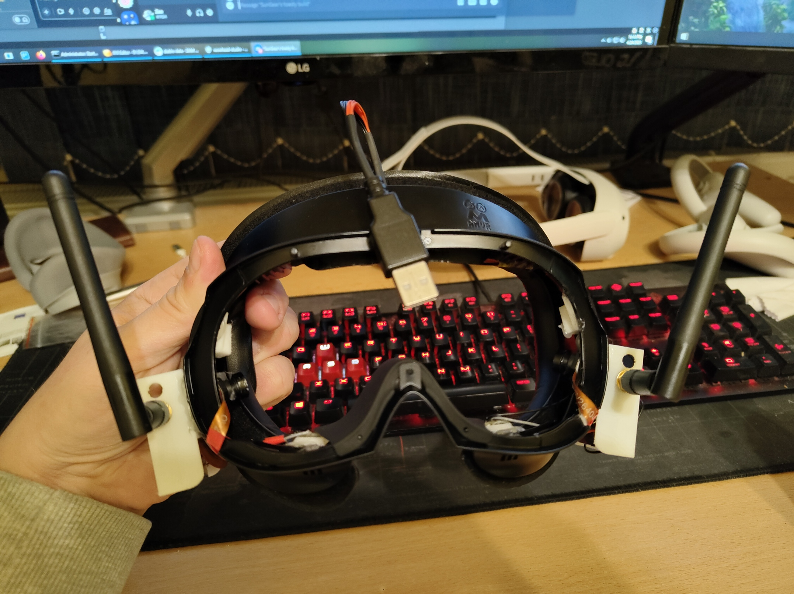
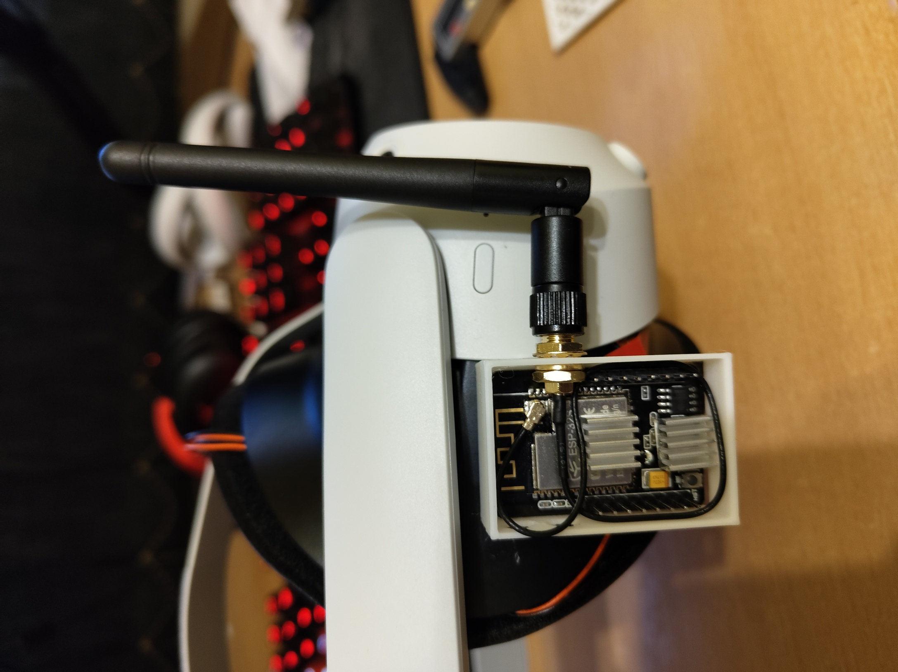

# Pico4EyeTracking

Personal hardware/software project for adding eye tracking to the Pico 4 HMD.

The device is built inside an AMVR Facial Interface I got from amazon for the Pico 4. It is completely standalone, so can be easily removed and replaced with the default facial interface that came with the HMD.

The printed parts in the build are found in https://github.com/CucFlavius/Pico4EyeTracking/tree/main/Hardware/3D%20Model%20Prototyping/Max%20Project/export
and they are:

- EspHolder.obj
- EspHolderLid.obj
- IRMountALeft.obj
- IRMountARight.obj
- IRMountBLeft.obj
- IRMountBRight.obj

All credit for the software and hardware goes to **EyeTrackVR**:

https://github.com/RedHawk989/EyeTrackVR

https://docs.eyetrackvr.dev/

**Previews:**

